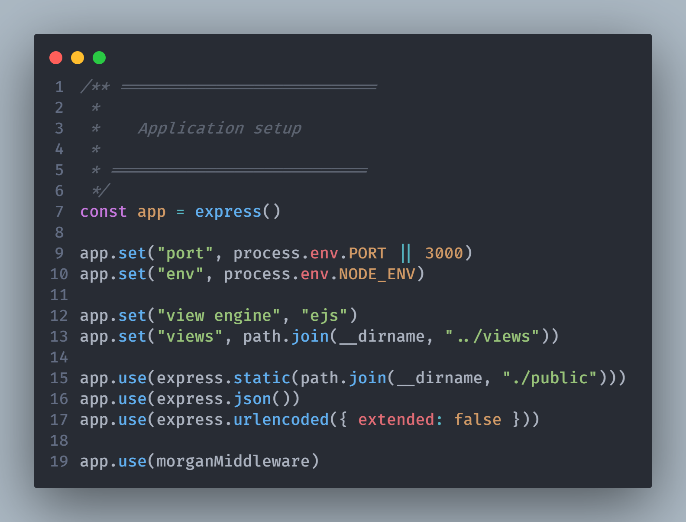

# Incode Mentor
> Full stack nodejs application server side rendering

## Table of contents
- [Incode Mentor](#incode-mentor)
  - [Table of contents](#table-of-contents)
  - [General info](#general-info)
  - [Screenshots](#screenshots)
  - [Technologies](#technologies)
  - [Setup](#setup)
  - [Code Examples](#code-examples)
  - [Features](#features)
  - [Status](#status)
  - [License](#license)
  - [Contact](#contact)

## General info
Add more general information about project. What the purpose of the project is? Motivation?

## Screenshots


## Technologies
* expressjs
* ejs
* postgresql

## Setup


1. **clone** the repo
2. you have to install **postgresql** database
3. using **npm** to install the packages


## Code Examples
to start the server
```bash
npm start
```
to start in development mode
```bash
npm run dev
```

## Features
List of features ready and TODOs for future development
* in progress feature 1
* in progress feature 2
* in progress feature 3

To-do list:
* in progress improvement to be done 1
* in progress improvement to be done 2

## Status
Project is: _in progress_
I just start the project

<!-- ## Inspiration
Add here credits. Project inspired by..., based on... -->

## License
MIT


## Contact
Created by [@mhdalmajid](https://twitter.com/mhdalmajid) - feel free to contact me!